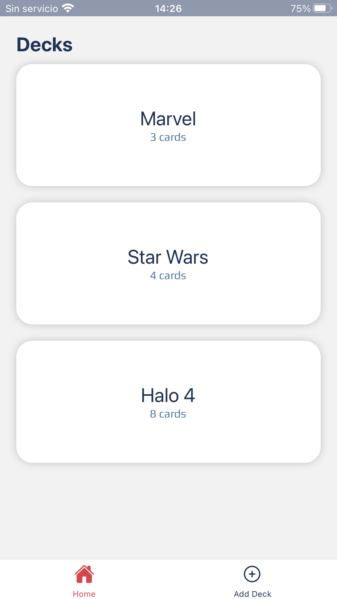
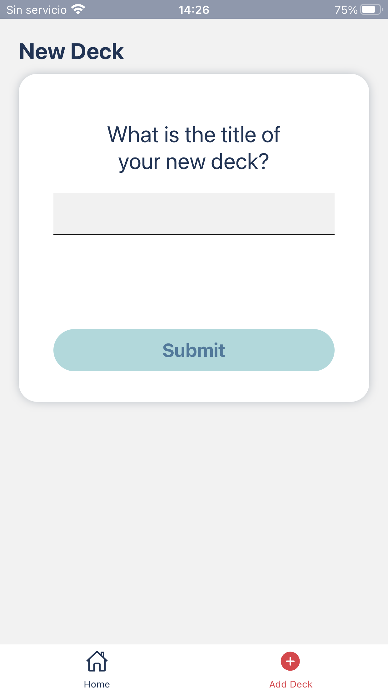
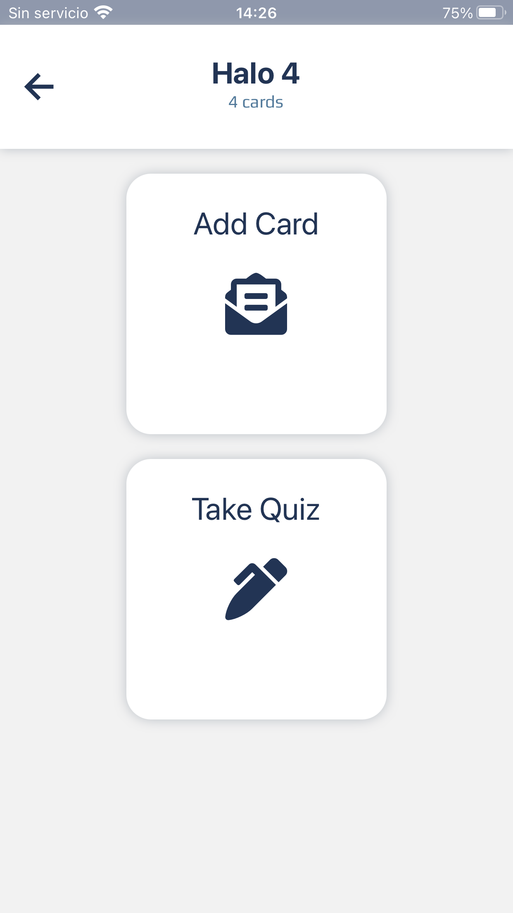
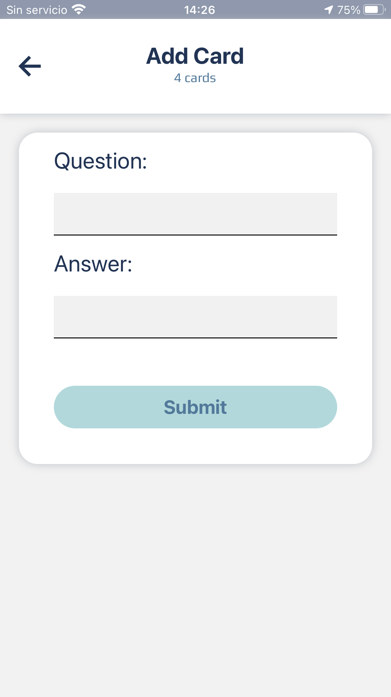
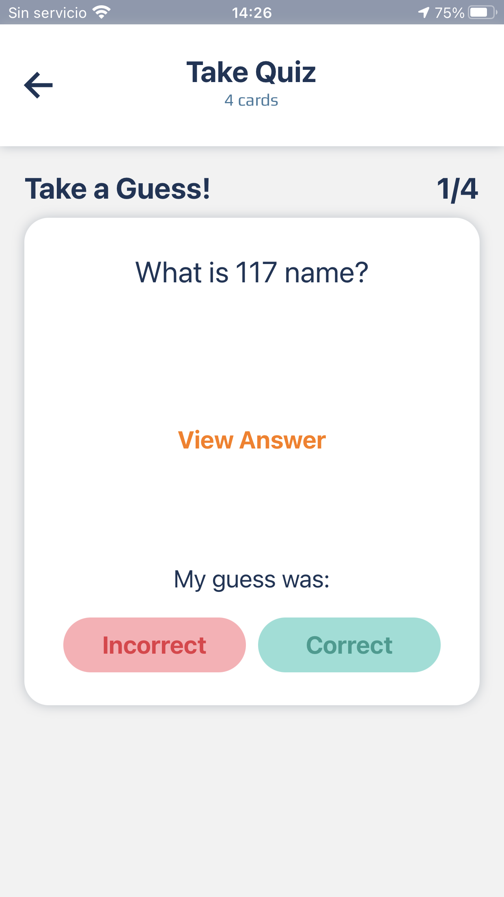

# FLASH CARDS

Flash cards, it's the final project for the Udacity React ND program made with react native

## Installation

clone this repository and run

```bash
yarn or npm install
```

## Usage

to start the app simply run:

```bash
yarn start
```

then you can scan the QR code with your smart phone to use the app or you can run it with the web option.

## Contributing

Pull requests are welcome. For major changes, please open an issue first to discuss what you would like to change.

Please make sure to update tests as appropriate.

## Images of the App






